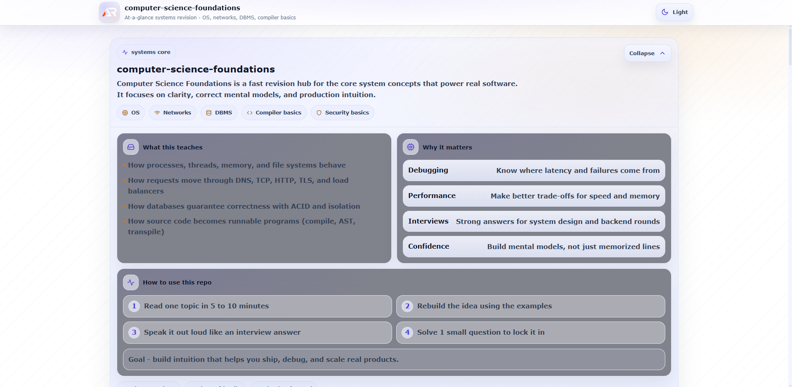

# Computer Science Foundations

This repo makes you dangerous.

A single-page, structured revision project covering the core subjects that power real-world software systems.

If DSA trains your brain, this repo trains your system-level thinking.

---

---

## Purpose

- Build deep understanding of how computers actually work
- Strengthen backend and systems thinking
- Prepare for system design interviews
- Improve debugging and performance intuition
- Connect theory with real production behavior

---

## Coverage

### Operating Systems

- Process vs Thread
- Scheduling Algorithms
- Context Switching
- Memory Management
- Virtual Memory
- Paging
- Deadlock
- File Systems

### Computer Networks

- OSI Model
- TCP vs UDP
- HTTP Lifecycle
- HTTPS and SSL
- DNS
- Load Balancing
- WebSockets

### DBMS Concepts

- ACID Properties
- Transactions
- Indexing
- Normalization
- Isolation Levels
- Locking

### Compiler Basics

- Compilation vs Interpretation
- Abstract Syntax Tree (AST)
- Transpilers

---

## Why This Repo Matters

Most developers learn frameworks.

Few understand:

- How memory actually works
- Why threads block
- Why network calls fail
- Why databases lock
- Why latency increases
- Why race conditions happen

This repo connects theory to real engineering problems.

---

## Structure

- Single-page, at-a-glance layout
- Expand and collapse sections
- Beginner explanations
- Real-world examples
- Clear terminology and full forms

---

## Tech Stack

- React (Vite)
- Styled Components
- GitHub Pages deployment

---

## Live

https://a2rp.github.io/computer-science-foundations/

---

## Author

Ashish Ranjan  
GitHub: https://github.com/a2rp  
Portfolio: https://www.ashishranjan.net  
LinkedIn: https://www.linkedin.com/in/aashishranjan  
Facebook: https://www.facebook.com/theash.ashish/

---

## License

MIT
