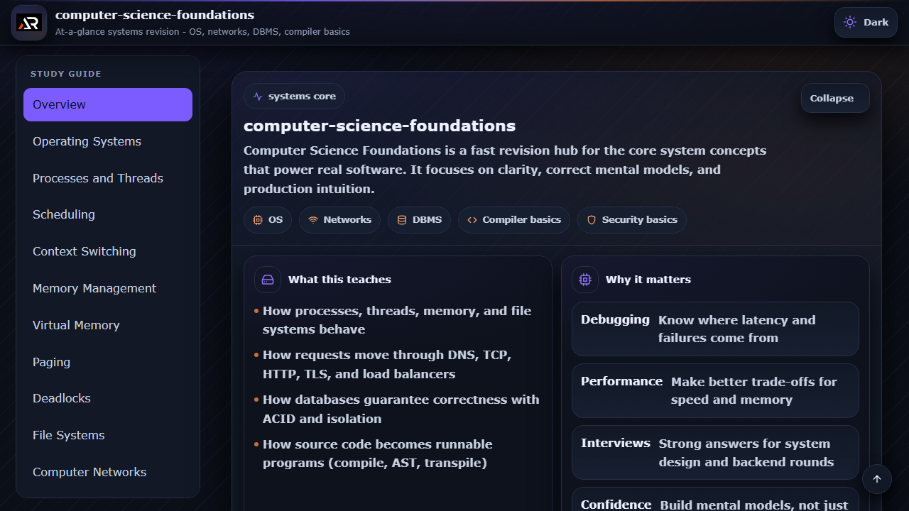

# Computer Science Foundations

A focused React and Vite revision workspace for the core subjects that shape real-world software systems, from operating systems and networks to databases and compilers.



## Features

- Structured navigation across systems, databases, networking, and compiler topics
- Expandable notes with beginner-friendly explanations and practical examples
- Independent study menu and content scrolling
- Dark and light theme support
- Responsive layout for desktop and mobile screens

## Tech stack

- React
- Vite
- styled-components
- React Icons

## Run locally

```bash
npm install
npm run dev
```

Build and deploy to GitHub Pages with:

```bash
npm run build
npm run deploy
```

## Links

- Portfolio: [https://www.ashishranjan.net/](https://www.ashishranjan.net/)
- GitHub: [https://github.com/a2rp](https://github.com/a2rp)
- CodePen: [https://codepen.io/ash1198](https://codepen.io/ash1198)
- LinkedIn: [https://www.linkedin.com/in/aashishranjan](https://www.linkedin.com/in/aashishranjan)
- Facebook: [https://www.facebook.com/theash.ashish/](https://www.facebook.com/theash.ashish/)
- YouTube: [https://www.youtube.com/@ashishranjan-ashz?sub_confirmation=1](https://www.youtube.com/@ashishranjan-ashz?sub_confirmation=1)
- Email: [ash.ranjan09@gmail.com](mailto:ash.ranjan09@gmail.com)

## Support

- Support: [https://a2rp-donation-page.netlify.app/](https://a2rp-donation-page.netlify.app/)
- Buy Me a Coffee: [https://buymeacoffee.com/a2rp](https://buymeacoffee.com/a2rp)
- Patreon: [https://www.patreon.com/a2rp](https://www.patreon.com/a2rp)
